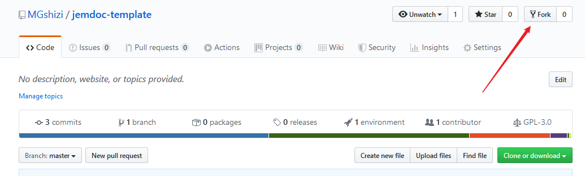
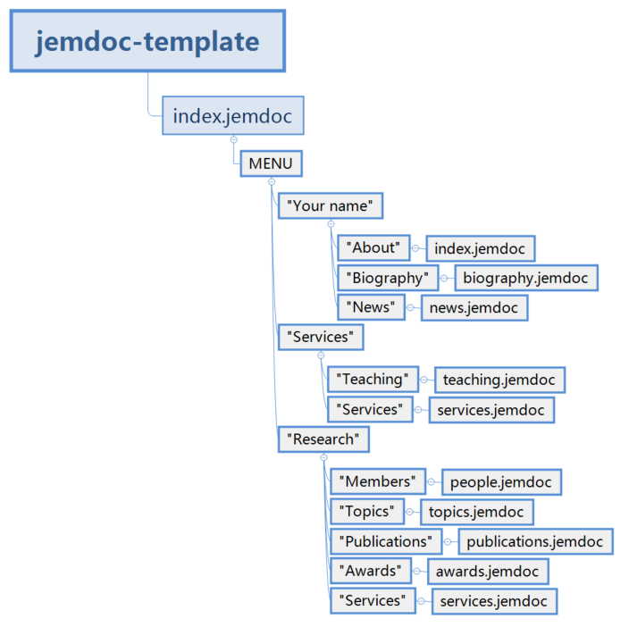

# Build up your own website based on Jemdoc & GitHub Pages


## 1. Fork template

Fork jemdoc tempalte from https://github.com/MGshizi/jemdoc-template



## 2. Setting `GitHub Pages`

Open the repository your just forked.

- `Settings`  

  

- Rename the repository your like, eg: Mywebsite

  

- Scroll down to `GitHub Pages` -> ①, select `master branch` in the check box below `Source` -> ②, then the page will flash automatically, and your can get the website url -> ③

  

## 3. Change the template

After cloning the repository you just forked and renamed to local, you can change the your website as like as you want.

Structure of the template:



You can change the `.jemdoc` file to customize your website. 

There are some links to learn about jemdoc:

- http://jemdoc.jaboc.net/using.html
- https://www.jianshu.com/p/88ac1961d7d6
- https://www.jianshu.com/p/34435af74f7e

## 4. Update your website

After changing the profile, run the command following:

```shell
./run1.bat
./run2.bat
```

Then the changes will be update to your website.

